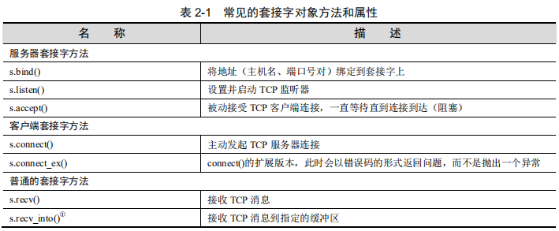

## 网络编程

### 客户端/服务端架构

​	服务器就是一系列硬件或软件，为一个或多个客户端（服务的用户）提供所需的“服务”。它存在唯一目的就是等待客户端的请求，并响应它们（提供服务），然后等待更多请求。

​	客户端因特定的请求而联系服务器，并发送必要的数据，然后等待服务器的回应，最后完成请求或给出故障的原因。服务器无限地运行下去，并不断地处理请求；而客户端会对服务进行一次性请求，然后接收该服务，最后结束它们之间的事务。客户端在一段时间后可能会再次发出其他请求，但这些都被当作不同的事务。

​	硬件服务器：打印服务器、文件服务器

​	软件服务器：Web服务器、数据库服务器、窗体（window）服务器

### 网络编程

​	在服务器响应客户端请求之前，必须进行一些初步的设置流程来为之后的工作做准备。首先会创建一个通信端点，它能够使服务器监听请求。

​	客户端需要创建它的单一通信端点，然后建立一个到服务器的连接。然后，客户端就可以发出请求，该请求包括任何必要的数据交换。一旦请求被服务器处理，且客户端收到结果或某种确认信息，此次通信就会被终止。

#### 套接字：通信端点

-  套接字

  -  AF_UNIX（又名AF_LOCAL），代表地址家族（adress family）：UNIX。因为两个进程运行在同一台计算机上，所以这些套接字都是基于文件的，这意味着文件系统支持它们的底层基础结构。这是能够说得通的，因为文件系统是一个运行在同一主机上的多个进程之间的共享常量。
  - AF_INET，代表地址家族：英特网。基于网络。
  - 总的来说，Python 只支持 AF_UNIX、AF_NETLINK（允许使用标准的 BSD 套接字接口进行用户级别和内核级别代码之间的 IPC）、AF_TIPC（TIPC 允许计算机集群之中的机器相互通信） 和 AF_INET 家族。

- 套接字地址：主机-端口对

- 面向连接的套接字：流套接字

  ​	面向连接的通信提供序列化的、可靠的和不重复的数据交付，而没有记录边界。这基本上意味着每条消息可以拆分成多个片段，并且每一条消息片段都确保能够到达目的地，然后将它们按顺序组合在一起，最后将完整消息传递给正在等待的应用程序。

  ​	实现这种连接类型的主要协议是传输控制协议（TCP）。为创建 TCP 套接字，必须使用 SOCK_STREAM 作为套接字类型。TCP 套接字的名字SOCK_STREAM 基于流套接字的其中一种表示。因为这些套接字（AF_INET）的网络版本使用因特网协议（IP）来搜寻网络中的主机，所以整个系统通常结合这两种协议（TCP 和 IP）来进行（也可以使用 TCP 和本地[非网络的 AF_LOCAL/AF_UNIX]套接字，但是很明显此时并没有使用 IP）。

- 无连接的套接字：数据报类型的套接字

  ​	在通信开始之前并不需要建立连接。此时，在数据传输过程中并无法保证它的顺序性、可靠性或重复性。然而，数据报确实保存了记录边界，这就意味着消息是以整体发送的，而并非首先分成多个片段，例如，使用面向连接的协议。

  ​	**区别**：由于面向连接的套接字所提供的保证，因此它们的设置以及对虚拟电路连接的维护需要大量的开销。然而，数据报不需要这些开销，即它的成本更加“低廉”。因此，它们通常能提供更好的性能，并且可能适合一些类型的应用程序。

  ​	实现这种连接类型的主要协议是用户数据报协议（UDP）。创建 UDP 套接字，必须使用 SOCK_DGRAM 作为套接字类型。这些套接字使用因特网协议来寻找网络中的主机，所以这个系统简称 UDP/IP。

### Python中的网络编程

-  `socket()`模块函数

  ```python
  socket.socket(socket_family, socket_type, protocol=0)
  # 创建TCP/IP套接字
  tcpSock = socket.socket(socket.AF_INET, socket.SOCK_STREAM)
  # 创建UDP/IP套接字
  udpSock = socket.socket(socket.AF_INET, socket.SOCK_DGRAM)
  ```

- 套接字对象（内置）方法

  

  

### SocketServer模块


### Twisted框架


